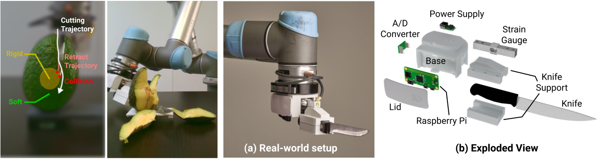

# RoboNinja: Learning an Adaptive Cutting Policy for Multi-Material Objects
[Zhenjia Xu](http://www.zhenjiaxu.com/)<sup>1</sup>,
[Zhou Xian](https://www.zhou-xian.com/)<sup>2</sup>,
[Xingyu Lin](https://xingyu-lin.github.io/)<sup>3</sup>,
[Cheng Chi](https://cheng-chi.github.io/)<sup>1</sup>,
[Zhiao Huang](https://sites.google.com/view/zhiao-huang)<sup>4</sup>,
[Chuang Gan](https://people.csail.mit.edu/ganchuang/)<sup>5&dagger;</sup>,
[Shuran Song](https://www.cs.columbia.edu/~shurans/)<sup>1&dagger;</sup>
<br>
<sup>1</sup>Columbia University, <sup>2</sup>CMU, <sup>3</sup>UC Berkeley, <sup>4</sup>UC San Diego, <sup>5</sup>UMass Amherst & MIT-IBM Lab

RSS 2023

### [Project Page](https://roboninja.cs.columbia.edu/) | [Video](https://youtu.be/SyEAP_jlgSQ) | [arXiv](https://arxiv.org/abs/2302.11553)

This repository contains code for training and evaluating RoboNinja in both simulation and real-world settings.



## Installation
We recommend [Mambaforge](https://github.com/conda-forge/miniforge#mambaforge) instead of the standard anaconda distribution for faster installation: 
```console
$ mamba env create -f environment.yml
```

but you can use conda as well:
```console
$ conda env create -f environment.yml
```
Activate conda environment and login to [wandb](https://wandb.ai/).
```console
$ conda activate roboninja
$ wandb login
```


## Simulation and Trajectory Optimization
### Rigid Core Generation
Generate cores with in-distribution geometries (300 train + 50 eval)
```console
$ python roboninja/workspace/bone_generation_workspace.py
```
Generate cores with out-of-distribution geometries (50 eval)
```console
$ python roboninja/workspace/bone_generation_ood_workspace.py
```
### Quick Example
[simulation_example.ipynb](simulation_example.ipynb) provides a quick example of the simulation. It first create a scene and render an image. It then runs a forward pass a backward pass using the initial action trajectory. Finally, it executes an optimized action trajectory.

If you get an error related to rendering, here are some potential solutions:
- make sure [vulkan](https://www.vulkan.org/) is installed
- `TI_VISIBLE_DEVICE` is not correctly set in [roboninja/env/tc_env.py](roboninja/env/tc_env.py) (L17). The reason is that vukan device index is not alighed with cuda device index, and that's the reason I have the function called `get_vulkan_offset()`. Change this function implementation based on your setup.
### Trajectory Optimization via Differentiable Simulation
```console
$ python roboninja/workspace/optimization_workspace.py name=NAME
```
Here `{NAME}` typically choose `expert_{X}`, where `X` is the index of the rigid core. Loss curve are logged as `roboninja/{NAME}` on [wandb](https://wandb.ai) as well as visualization of intermediate results. The final result will be saved in `data/optimization/{NAME}`. Configurations are stored in `roboninja/config/optimization_workspace.yaml`.

## Training
### State Estimation
```console
$ python roboninja/workspace/state_estimation_workspace.py
```
Loss curve are logged as `roboninja/state_estimation` on wandb as well as visualization on both training and testing sets. Checkpoints will be saved in `data/state_estimation`. Configurations are stored in `roboninja/config/state_estimation_workspace.yaml`.

### Cutting Policy
```console
$ python roboninja/workspace/close_loop_policy_workspace.py dataset.expert_dir=data/expert
```
Here is the training script using the provided expert demonstraitons stored in `data/expert`. You can also change the directory to the trajectories you collected in the previous step. Loss curve are logged as `roboninja/close_loop_policy` on wandb as well as visualization with different tollerance values. Checkpoints will be saved in `data/close_loop_policy`. Configurations are stored in `roboninja/config/close_loop_policy_workspace.yaml`.

## Evaluation in Simulation
### Pretrained Model
Pretrained models can be downloaded by:
```consolo
wget https://roboninja.cs.columbia.edu/download/roboninja-pretrined.zip
```
Unzip and remember to change the `state_estimation_path` and `close_loop_policy_path` in `roboninja/configs/eval_workspace.yaml`.

### Evaluation Environments
We provide two type of simulaiton environments for evaluation:
- `sim`: a geometry-based simulation that incorporates collision detection. It is designed to calculate cut mass and the number of collisions. This simulation is very fast. It is very fast but can not estimate energy consumption.
- `taichi`: The physics-based simulaiton implemented in Taichi and used for trajectory optimization.  It is slower compared to the `sim` environment but supports energy consumption estimation. Simulation results in our paper are evaluated using this environment.

Here is the command using `taichi` environment:
```console
$ python roboninja/workspace/eval_workspace.py type=taichi
```
Results  will be saved in `data/eval`

## Real-world Evaluation
### Hardware
- [UR5-CB3](https://www.universal-robots.com/cb3) or [UR5e](https://www.universal-robots.com/products/ur5-robot/) ([RTDE Interface](https://www.universal-robots.com/articles/ur/interface-communication/real-time-data-exchange-rtde-guide/) is required)
- [Millibar Robotics Manual Tool Changer](https://www.millibar.com/manual-tool-changer/) (only need robot side)
- [Kinetic Sand](https://www.kineticsand.com/)
- Digital load cell and HX711 A/D converter. [Amazon link](https://a.co/d/8OnGKc2)
- [Raspberry Pi Zero 2 W](https://www.raspberrypi.com/products/raspberry-pi-zero-2-w/)
- 3D printed [container](https://cad.onshape.com/documents/34a7adf2245e1f1aefe4f5d0/w/65aa8948d8464ef9822f393e/e/7dcafa19279e7f4bd5068955?renderMode=0&uiState=644f4aa6986ea17f6703fd5d) for assembly.
- knife

Relevant tutorial: https://tutorials-raspberrypi.com/digital-raspberry-pi-scale-weight-sensor-hx711/

### Setup Raspberry Pi
Copy `roboninja/real_world/server_udp.py` into Raspberry Pi and run
```concolo
python server_udp.py
```
### Evaluate Cutting Policy
Update ip address and other configurations in `roboninja/configs/real_env.yaml`, and run
```concolo
python roboninja/workspace/eval_workspace.py type=real bone_idx={INDEX}
```

## BibTeX
```
@inproceedings{xu2023roboninja,
	title={RoboNinja: Learning an Adaptive Cutting Policy for Multi-Material Objects},
	author={Xu, Zhenjia and Xian, Zhou and Lin, Xingyu and Chi, Cheng and Huang, Zhiao and Gan, Chuang and Song, Shuran},
	booktitle={Proceedings of Robotics: Science and Systems (RSS)},
	year={2023}
}
```
## License
This repository is released under the MIT license. See [LICENSE](LICENSE) for additional details.

## Acknowledgement
- Physics simulator is adapted from [FluidLab](https://github.com/zhouxian/FluidLab).
- UR5 controller is adapted from [Diffusion Policy](https://github.com/columbia-ai-robotics/diffusion_policy).
- Force sensor is inspired by [this toterial](https://tutorials-raspberrypi.com/digital-raspberry-pi-scale-weight-sensor-hx711/).